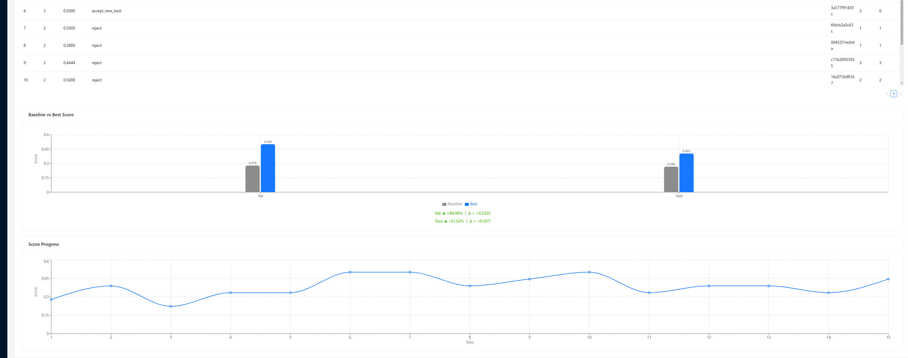
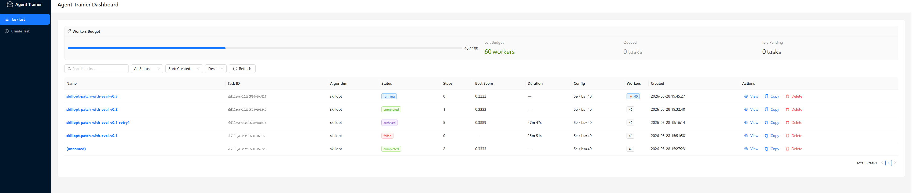

# Agent Trainer — 训练算法原理与实现

本文档介绍 SummerClaw Agent Trainer 中已实现的训练算法的原理和实现逻辑。

---

## Dashboard 监控面板

Agent Trainer 提供基于 **FastAPI + React (Ant Design)** 的 Web Dashboard，支持训练任务的可视化管理、实时监控与一键操作。Dashboard 通过 Channel 命令 `/train` 自动启动，并可通过 **Tailscale Funnel** 生成公网 HTTPS 链接实现远程访问。


*Dashboard 界面概览：顶部显示训练状态（Running / Idle）、Best Score、当前 Step 与 Epoch 进度；中部为分数趋势折线图（recharts）与训练历史明细表格（Step、Epoch、Score、Action、Edits、Rejected 等字段）；底部为终端风格的实时事件日志流（自动滚动）。左侧面板支持任务管理（创建/删除/复制）、JSONL 数据上传与自动 train/val/test 分割、YAML 配置在线编辑与模板下载。所有操作均通过 REST API 驱动，支持无界面 headless 模式。*

**核心功能：**
- **实时状态面板**：Best Score、当前 Step/Epoch、训练状态（Running / Idle / Completed）
- **分数趋势可视化**：折线图展示每步 validation score 变化，直观观察训练收敛趋势
- **训练历史表格**：逐步展示 gate 决策结果（accept_new_best / accept / reject）、应用的编辑数、被拒绝的编辑数
- **事件日志流**：终端风格的实时日志，展示 rollout 结果、reflect 分析、patch 合并等关键事件
- **任务管理**：创建训练任务、上传数据（自动 split）、编辑 YAML 配置、一键启动/取消训练
- **Skill 部署**：训练完成后一键将 `best_skill.md` 部署到目标路径
- **公网访问**：通过 Tailscale Funnel 自动生成公网 HTTPS URL，无需端口映射

---

## 训练环境与配置

训练环境通过 `SummerClawEnvAdapter` 桥接在线 Agent 的完整运行时（工具集、记忆系统、模型配置），同时保证数据流完全隔离——训练不会污染在线 Agent 的记忆和会话。


*训练环境架构与配置面板：展示 `SummerClawEnvAdapter` 的隔离架构——左侧为在线 Agent 运行时（Memory Store、ToolRegistry、ContextBuilder），右侧为训练隔离工作空间 `train-outputs/<alg>-<task>/`，两者共享相同的 Memory 算法类型和工具集，但数据读写路径完全独立。配置区域展示 YAML `env` section 的关键参数：`memory_algorithm`（支持 8 种记忆算法）、`enabled_tools`（工具白名单）、`split_mode`（ratio / split_dir 数据切分策略）、`exec_timeout`（单次调用超时）等。*

**Memory 算法配置**（`env.memory_algorithm`）：

训练环境支持与在线 Agent 完全相同的 Memory 算法体系，通过 YAML 配置选择：

| 算法 | 配置值 | 说明 |
|------|--------|------|
| 禁用记忆 | `null`（默认） | 训练过程中不使用记忆模块，每轮 rollout 无记忆积累 |
| Naive | `naive_memory` | 基础记忆算法，简单的对话历史存储与检索 |
| Nemori | `nemori_memory` | 结构化记忆，支持记忆提取、关联与遗忘机制 |
| LayerGA | `layerga_memory` | 分层遗传算法驱动的记忆优化 |
| Mem0 v3 | `mem0v3_memory` | Mem0 第三版记忆系统 |
| SuperMemory | `supermemory_memory` | 增强型记忆系统 |
| Hindsight | `hindsight_memory` | 事后经验回放记忆 |
| Mastra OM | `mastra_om_memory` | Mastra Observational Memory，基于观察的记忆整合与召回 |

> **隔离原则**：训练使用与在线相同类型的 Memory 算法（如在线用 `nemori_memory`，训练也用 `nemori_memory`），但 Memory Store 数据写入训练工作空间隔离目录，不会污染在线 Agent 的记忆。

**工具集与数据切分：**

- `env.enabled_tools`：控制训练 Agent 可用工具。空列表（默认）= 启用所有默认工具；指定列表 = 仅启用列出的工具
- `env.split_mode`：`ratio`（按比例自动切分，如 `"2:1:7"`）或 `split_dir`（使用预切分目录）
- `env.exec_timeout`：单次目标模型调用超时（默认 120 秒）

```yaml
# 训练环境配置示例
env:
  memory_algorithm: nemori_memory
  enabled_tools:
    - web_search
    - code_execute
    - file_read
  split_mode: split_dir
  split_dir: ./resources/trainer-skillopt/split_jsonl
  exec_timeout: 120
```

---

## 1. SkillOpt — 结构化技能优化

SkillOpt 是目前已实现的训练算法，核心思想是通过**反思式优化**（Reflective Optimization）迭代改进 Agent 的 Skill 文档。每个训练 Step 执行 6 个阶段的 Pipeline，类比于神经网络中的前向传播 → 反向传播 → 梯度裁剪 → 优化器步进。

### 1.1 总体架构

```
                     ┌──────────────────────────────────────┐
                     │          TrainerEngine               │
                     │   (算法无关的训练循环编排器)          │
                     └──────────────┬───────────────────────┘
                                    │
              ┌─────────────────────┼─────────────────────┐
              │                     │                     │
    ┌─────────▼─────────┐  ┌───────▼────────┐  ┌────────▼────────┐
    │ SummerClawEnvAdapter│  │ SkillOptAlgorithm│  │   DataLoader    │
    │ (Agent 环境适配)    │  │ (6 阶段算法)     │  │ (数据加载)      │
    └────────────────────┘  └────────────────┘  └─────────────────┘
```

SkillOpt 将 Skill 优化分解为 6 个阶段，每个阶段对应一个明确的职责：

| 阶段 | 类比 | 职责 |
|------|------|------|
| ① Rollout | 前向传播 | 用当前 Skill 执行 Agent 推理 |
| ② Reflect | 反向传播 | 分析成功/失败轨迹，生成修改建议 |
| ③ Aggregate | 梯度聚合 | 层级合并多个独立生成的 Patch |
| ④ Select | 梯度裁剪 | 按重要性排序，保留 Top-L 编辑 |
| ⑤ Update | 优化器步进 | 将编辑应用到 Skill 文档 |
| ⑥ Evaluate | 验证评估 | 验证集打分 + Accept/Reject 门控 |

---

### 1.2 阶段 1：Rollout（前向传播）

**目标**：使用当前 Skill 在真实环境中执行 Agent 推理，收集成功和失败的轨迹。

**实现**：`SkillOptAlgorithm.rollout()` → `SummerClawEnvAdapter.rollout_batch()`

```
对每个训练 item：
  1. 构建 System Prompt = 基础提示 + 隔离记忆 + 当前 Skill 注入
  2. 构建 User Prompt = context + question
  3. 调用 AgentRunner.run(spec) 执行完整的 ReACT 推理循环
  4. 从结果中提取 hard (0/1) 和 soft (0.0~1.0) 分数
  5. 捕获完整对话轨迹（用于 Reflect 阶段分析）
```

**评分机制**：
- **Exact Match**：大小写不敏感子串匹配，任意一个 `answers` 候选答案 `∈ predicted` → hard=1, soft=1.0
- **关键词重叠**：计算每个候选答案与 predicted 的词集合交集比例，取最大值，≥0.8 → hard=1
- **Custom Scorer**：加载 `custom-scorer.py` 中的 `score(sample, predicted) -> float`，输出 0~1
- **无标准答案**：只要 Agent 产生输出且未报错 → hard=1, soft=0.5

**并发控制**：通过 `asyncio.Semaphore(effective_workers)` 限制同时执行的 rollout 数量。`effective_workers` 来源于 `train.workers` 配置（见 §3.5 统一并发控制模型）。

---

### 1.3 阶段 2：Reflect（反向传播）

**目标**：分析 Rollout 轨迹中的成功和失败模式，生成结构化的编辑建议（Patch）。

**实现**：`run_minibatch_reflect()` in `reflect.py`

#### Minibatch 策略

Reflect 阶段采用 **Minibatch 并行**策略：

1. 将 Rollout 结果按 hard score 分为 **failure 组**（hard=0）和 **success 组**（hard=1）
2. 每组按 `minibatch_size`（默认 5）切分为多个小批次
3. 每个小批次独立调用 LLM 进行分析（所有小批次并行执行）
4. 每个 LLM 调用最多产出 `edit_budget`（L）个编辑建议

```
Rollout Results (N items)
    ├── Failures (n_fail)
    │   ├── minibatch_0 (M items) → LLM → RawPatch
    │   ├── minibatch_1 (M items) → LLM → RawPatch
    │   └── ...
    └── Successes (n_succ)
        ├── minibatch_0 (M items) → LLM → RawPatch
        └── ...
```

#### 两种 Analyst

- **Error Analyst**（`run_error_analyst_minibatch`）：分析失败轨迹，识别根因，提出修复性编辑
- **Success Analyst**（`run_success_analyst_minibatch`）：分析成功轨迹，识别优势模式，提出增强性编辑

每个 Analyst 的 LLM Prompt 包含：
- 当前 Skill 文档全文
- 编辑预算约束（最多 L 个编辑）
- 前序 Step 上下文（避免重复建议）
- 格式化的轨迹文本（含 task、predicted answer、reference、trajectory）

#### 轨迹格式化

`fmt_trajectory()` 将对话历史格式化为分析友好的文本：
- `[assistant]` — Agent 的文本输出
- `[call]` — 工具调用（函数名 + 参数摘要）
- `[tool:name]` — 工具返回结果（截断至 800 字符）
- 单条轨迹最大 12,000 字符，超出时保留头尾、截断中间

#### 输出格式

每个 RawPatch 包含：
```json
{
    "patch": {
        "reasoning": "失败模式的简要说明",
        "edits": [
            {"op": "append", "content": "新增内容"},
            {"op": "replace", "content": "替换后内容", "target": "被替换原文"},
            {"op": "insert_after", "content": "插入内容", "target": "插入位置标记"},
            {"op": "delete", "target": "要删除的内容"}
        ]
    },
    "source_type": "failure | success",
    "batch_size": 5
}
```

---

### 1.4 阶段 3：Aggregate（梯度聚合）

**目标**：将多个独立生成的 Patch 合并为一个连贯的统一 Patch。

**实现**：`merge_patches()` in `aggregate.py`

#### 层级合并策略

采用**三路层级合并**，failure 驱动的 Patch 优先级高于 success 驱动：

```
Step 1: 合并所有 Failure Patches
    [fail_0, fail_1, fail_2, ...] → hierarchical_merge → failure_merged

Step 2: 合并所有 Success Patches
    [succ_0, succ_1, ...] → hierarchical_merge → success_merged

Step 3: 最终合并（Failure 优先）
    [failure_merged, success_merged] → LLM final merge → final Patch
```

#### 层级合并算法（`_hierarchical_merge`）

当 Patch 数量较多时，采用树状层级合并：

```
Level 0:  [P0, P1, P2, P3, P4, P5, P6, P7, P8, P9]
           ↓    ↓    ↓    ↓    ↓
Level 1:  [M01, M23, M45, M67, M89]       (每 8 个一批合并)
           ↓    ↓
Level 2:  [M0123, M4567, M89]
           ↓
Level 3:  [Final]
```

每层将 Patch 按 `batch_size=8` 分组，每组调用一次 LLM 合并，结果进入下一层，直到收敛为单个 Patch。

#### Fallback 机制

- LLM 合并失败时，回退到**简单拼接**所有编辑
- 最终合并失败时，回退到 failure 编辑在前、success 编辑在后的拼接

---

### 1.5 阶段 4：Select（梯度裁剪）

**目标**：从合并后的编辑池中，按重要性排序并选择 Top-L 个编辑，控制每步的"学习步长"。

**实现**：`rank_and_select()` in `select.py`

#### 工作原理

1. **预算内直接通过**：如果编辑数量 ≤ edit_budget（L），直接返回原 Patch
2. **LLM 排序**：编辑数量超预算时，将所有编辑以编号列表呈现给 LLM，要求按影响力排序
3. **选择 Top-L**：按 LLM 返回的优先级顺序选取前 L 个编辑

```
Edit Pool (N edits, N > L)
    │
    ▼
LLM Ranking Prompt:
    "Select the L most important edits.
     Return their 0-based indices in priority order."
    │
    ▼
selected_indices: [3, 0, 7, 1]  → 取前 L 个
    │
    ▼
Selected Patch (L edits)
```

#### Fallback

LLM 排序失败时，简单截断前 L 个编辑。

---

### 1.6 阶段 5：Update（优化器步进）

**目标**：将选中的编辑顺序应用到 Skill 文档上，生成候选 Skill。

**实现**：`apply_patch_with_report()` in `update.py`

#### 四种编辑操作

| 操作 | 说明 | 行为 |
|------|------|------|
| `append` | 在文档末尾追加内容 | 如果存在 SLOW_UPDATE 区域，追加在其前面 |
| `insert_after` | 在指定 target 后插入 | target 未找到时 fallback 为 append |
| `replace` | 替换 target 文本 | target 未找到则跳过 |
| `delete` | 删除 target 文本 | target 未找到则跳过 |

#### SLOW_UPDATE 区域保护

Skill 文档中可以标记受保护区域：

```markdown
正常内容...

<!-- SLOW_UPDATE_START -->
这段内容不会被常规 Update 修改
<!-- SLOW_UPDATE_END -->
```

- `replace` / `delete` 操作的 target 如果落在 SLOW_UPDATE 区域内，会被**跳过**
- `append` 操作会在 SLOW_UPDATE 区域**之前**插入
- SLOW_UPDATE 区域的内容只能通过 Epoch 级的 `slow_update` 机制修改

#### 应用报告

每个编辑应用后生成详细报告，用于可观测性：

```json
{
    "index": 1,
    "op": "replace",
    "target": "原始文本片段...",
    "content_preview": "替换后内容...",
    "status": "applied_replace"
}
```

状态值包括：`applied_*`（成功）、`skipped_*`（跳过）、`error`（异常）。

---

### 1.7 阶段 6：Evaluate（验证评估）

**目标**：在验证集上评估候选 Skill 的质量，决定是否接受本次更新。

**实现**：`SkillOptAlgorithm.evaluate()` + `evaluate_gate()` in `gate.py`

#### 评估流程

1. 用候选 Skill 在验证集上执行 rollout（同阶段 1）
2. 计算 hard accuracy（正确数 / 总数）

#### 门控决策（`evaluate_gate`）

纯函数决策逻辑，类比于模型选择中的验证集早停：

```
if cand_score > current_score:
    if cand_score > best_score:
        → accept_new_best   (更新 current + 更新 best)
    else:
        → accept            (更新 current，best 不变)
else:
    → reject                (current 和 best 均不变)
```

- **accept_new_best**：候选 Skill 成为新的 current 和 best
- **accept**：候选 Skill 成为新的 current（但不是 best）
- **reject**：丢弃候选 Skill，保持 current 不变

#### 并发控制

Evaluate 阶段复用 Rollout 的 `rollout_batch()` 执行验证集评估，并发数由 `evaluate_workers` 控制（默认继承 `train.workers`）。

---

### 1.8 Rejected Buffer（拒绝缓冲区）

**目标**：记录被门控拒绝的编辑操作，作为负反馈注入后续的 Reflect / Aggregate LLM 调用，避免重复生成类似的无效编辑。

**实现**：`rejected_buffer.py`

#### 工作机制

当 Evaluate 阶段的门控决策为 `reject` 时：

1. Trainer 调用 `algorithm.record_rejection(step, patch, score_before, score_after)`
2. 被拒绝的 Patch 中的每条 Edit 被提取摘要（op + content 截断 + target），存入 `RejectedBuffer`
3. 后续步骤的 Reflect 和 Aggregate 阶段，缓冲区内容被格式化为 prompt 文本，注入到 LLM user prompt 中

#### 缓冲区设计

- **FIFO 淘汰**：当缓冲区满（默认 10 条）时，最早的记录被自动淘汰
- **训练全程持久**：跨 step 和 epoch 持续累积，通过 `state_dict` / `load_state_dict` 支持断点恢复
- **摘要截断**：每条编辑摘要默认最多 200 字符，避免 prompt 溢出

#### 注入位置

格式化后的拒绝上下文作为独立 section 注入 LLM prompt，位于 `meta_skill_context` 之后、`step_buffer_context` 之前：

```
## Previously Rejected Edits
The following edits were proposed in earlier steps but rejected by the validation gate.
Avoid generating similar or identical edits.

[Step 5] score=0.450→0.420 (delta=-0.030)
  - replace: “修改指令 X 的描述..." (target: section_X)
  - append: “添加关于 Y 的步骤..." (target: )
```

#### 配置参数

| 参数 | 默认值 | 说明 |
|------|--------|------|
| `optimizer.use_rejected_buffer` | `true` | 是否启用拒绝缓冲区 |
| `optimizer.rejected_buffer_max_size` | `10` | 缓冲区最大条目数 |
| `optimizer.rejected_buffer_max_summary_chars` | `200` | 每条编辑摘要的最大字符数 |

---

### 1.9 Epoch 级 Slow Update（纵向比较）

**目标**：在 Epoch 边界进行纵向对比，识别长期趋势。

**实现**：`slow_update.py`

#### 纵向比较

比较同一批 item 在两个相邻 Epoch 的 hard score 变化，分类为：

| 类别 | 条件 | 含义 |
|------|------|------|
| `improved` | 0 → 1 | 之前失败，现在成功 |
| `regressed` | 1 → 0 | 之前成功，现在失败 |
| `persistent_fail` | 0 → 0 | 持续失败 |
| `stable_success` | 1 → 1 | 持续成功 |

根据 delta（curr_hard_mean - prev_hard_mean）判断趋势：
- `delta > 0.01` → improving
- `delta < -0.01` → regressing
- 其他 → stable

---

## 2. 训练循环与控制流

### 2.1 完整训练流程

```
初始化:
  1. 加载训练数据 (DataLoader)
  2. 加载初始 Skill (skill_init)
  3. 计算 Baseline Score (验证集上的初始分数)
  4. 尝试断点恢复 (runtime_state.json)

训练循环:
  for epoch in 1..num_epochs:
      batches = shuffle(train_data, seed + epoch*1000)
      for batch in batches:
          ┌─ ① Rollout   → results
          │  ② Reflect   → raw_patches
          │  ③ Aggregate → merged_patch
          │  ④ Select    → selected_patch
          │  ⑤ Update    → candidate_skill
          │  ⑥ Evaluate  → gate_decision
          └─ Save State  → runtime_state.json

      on_epoch_end() hook

完成:
  发送 training_done 事件
  保留 best_skill.md 供部署
```

### 2.2 断点续训

每步结束后持久化以下状态：
- `skills/skill_v{step:04d}.md` — 当前 Skill 快照
- `best_skill.md` — 全局最优 Skill
- `history.json` — 完整训练历史
- `runtime_state.json` — last_completed_step、scores、skill paths

重启时 `_load_state()` 自动检测并从上次的 next step 恢复。

### 2.3 取消机制

通过 `request_cancel()` 设置取消标志，训练循环在每个 epoch 和每个 step 的开始检查该标志，实现优雅退出。

---

## 3. 关键设计决策

### 3.1 Minibatch Reflect vs 全量 Reflect

**选择 Minibatch**：将轨迹按 M=5 分组并行分析，而非一次性将所有轨迹喂给 LLM。

**原因**：
- 单次 LLM 调用的上下文窗口有限，大量轨迹会被截断
- 并行多个小批次可以覆盖更多轨迹模式
- 每个小批次独立产出 Patch，通过 Aggregate 阶段合并，降低单次分析的偏差

### 3.2 Failure-First 合并策略

Aggregate 阶段给予 failure-driven Patch 更高优先级。

**原因**：修复错误通常比增强优势更能提升整体分数。在最终合并时，failure Patch 的编辑被优先保留。

### 3.3 Edit Budget 作为学习率

`edit_budget`（L）控制每步最多应用的编辑数，类比于神经网络中的学习率：
- L 太大 → 单步改动过多，可能引入 regression
- L 太小 → 优化速度慢，需要更多 step
- 默认 L=4，在实验中取得较好平衡

### 3.4 验证门控而非强制接受

每个候选 Skill 必须通过验证门控才能被接受，避免“训练集过拟合”：
- 候选在验证集上的分数必须**严格优于**当前分数才能被接受
- 全局最优 Skill 独立追踪，最终部署时使用 best_skill 而非 current_skill

### 3.5 统一并发控制模型

所有阶段的 LLM 并发调用均由 `train.workers` 统一控制，各阶段默认继承该值，仅在需要单独调整时设置 per-stage 覆盖。

#### workers 自动推导

`train.workers` 设为 `0`（默认）时，自动推导为系统 `maxConcurrency` 的 80%：

```
effective_workers = max(1, int(provider.max_concurrency * 0.8))
```

设为正整数时直接使用指定值。优先级：`train.workers > 80% × maxConcurrency > fallback(4)`。

#### 各阶段并发配置

| 阶段 | 并发变量 | YAML 配置键 | 默认值 |
|------|----------|-------------|--------|
| ① Rollout | `env.workers` | `train.workers` | workers |
| ② Reflect | `algo.analyst_workers` | `gradient.analyst_workers` | workers |
| ③ Aggregate | `algo.aggregate_workers` | `gradient.aggregate_workers` | workers |
| ④ Select | 单次 LLM 调用 | — | — |
| ⑤ Update | 单次 LLM 或纯 Python | — | — |
| ⑥ Evaluate | `algo.evaluate_workers` | `gradient.evaluate_workers` | workers |

#### 配置示例

```yaml
# 统一设置（推荐）— 所有阶段并发 = 80% × maxConcurrency
train:
  workers: 0

# 手动指定统一并发
train:
  workers: 16

# 单独调整 Reflect 阶段（其他阶段仍用 train.workers）
train:
  workers: 16
gradient:
  analyst_workers: 24   # Reflect 阶段使用更高并发
```

#### Test 集评估

训练完成后自动在 test 集上执行两轮评估：
1. **With best skill**：使用训练过程中发现的最优 Skill
2. **Without skill（baseline）**：不注入任何 Skill 的对照组

结果输出到 `test_evaluation/test_summary.json`，包含 `score_with_skill`、`score_no_skill`、`delta`、`improvement_pct` 等指标。通过 `evaluation.eval_test: false` 可禁用。

---

## 4. 扩展新算法

基于 `BaseAlgorithm` 实现新算法只需实现 6 个抽象方法：

```python
from summerclaw.agent_trainer.base import BaseAlgorithm
from summerclaw.agent_trainer.registry import algorithm

@algorithm("dspy")
class DSPyAlgorithm(BaseAlgorithm):
    name = "dspy"

    async def rollout(self, env, skill, items, out_dir):
        # 自定义 rollout 逻辑
        ...

    async def reflect(self, results, skill, out_dir):
        # 自定义反思/分析逻辑
        ...

    async def aggregate(self, patches, skill):
        # 自定义合并策略
        ...

    async def select(self, patch, budget, skill):
        # 自定义选择策略
        ...

    async def update(self, skill, patch):
        # 自定义更新策略
        ...

    async def evaluate(self, env, skill, items, out_dir):
        # 自定义评估逻辑
        ...
```

注册后通过 `/train dspy` 即可从任意 Channel 启动训练。`TrainerEngine` 会自动编排 6 阶段 Pipeline，无需修改引擎代码。

---

## 5. 示例资源与数据格式（`resources/trainer-skillopt`）

`resources/trainer-skillopt` 目录提供了 SkillOpt 训练的完整示例资源，可作为自定义训练任务的参考模板。

### 5.1 目录结构

```
resources/trainer-skillopt/
├── skillopt.yaml             # SkillOpt 训练配置文件（复制后修改使用）
├── custom-scorer.py          # 自定义评分器示例
└── split_jsonl/              # 预切分数据集目录（配合 split_mode=split_dir 使用）
    ├── data.jsonl            # 训练集（54 条样本）
    ├── test.jsonl            # 测试集（125 条样本）
    └── example-rollout.json  # Rollout 结果示例（用于理解轨迹格式）
```

### 5.2 数据格式（JSONL）

训练数据为 JSONL 格式，每行一个 JSON 对象，字段定义如下：

| 字段 | 类型 | 必填 | 说明 |
|------|------|------|------|
| `id` | string | ✅ | 样本唯一标识，格式建议 `来源:序号`，如 `"202602:12"` |
| `question` | string | ✅ | 完整的任务 Prompt，包含指令、问题和选项 |
| `answers` | string[] | ✅ | 候选答案列表，支持多个正确答案（任一匹配即得分） |
| `context` | string | ❌ | 可选的上下文信息，无额外上下文时传空字符串 `""` |

**示例（数学推理多选题）：**

```json
{
  "id": "202602:12",
  "question": "You are an expert mathematical reasoning agent...\n\n## Question\n...\n\n## Choices\nA. ...\nB. ...\nC. ...",
  "answers": ["<answer>A</answer>"],
  "context": ""
}
```

> **提示**：`answers` 字段中的答案格式应与 Agent 输出的格式一致。示例中使用 `<answer>X</answer>` 标签包裹答案，配合 `custom-scorer.py` 进行精确匹配。

### 5.3 自定义评分器（`custom-scorer.py`）

当内置的 Exact Match 或关键词重叠评分不满足需求时，可提供自定义评分脚本。

**放置位置**：将 `custom-scorer.py` 放入训练输出目录（Dashboard 启动训练时会自动复制到任务目录），并在数据 item 中设置 `"scorer": "custom"`。

**接口规范**：

```python
def score(sample: dict, predicted: str) -> float:
    """
    Args:
        sample:    完整的数据 item dict（含 id、question、answers 等字段）
        predicted: Agent 输出的完整文本（assistant content）

    Returns:
        float: 0.0 ~ 1.0 的分数，1.0 表示完全正确
    """
```

**示例逻辑**（`resources/trainer-skillopt/custom-scorer.py`）：

该示例实现了从 Agent 输出中提取 `<answer>...</answer>` 标签内容，与候选答案进行精确比对：

1. 用正则提取 `predicted` 中最后一个 `<answer>...</answer>` 的内容
2. 同样提取 `sample["answers"]` 中每个候选答案的标签内容
3. 逐一比对，任意一个匹配即返回 `1.0`，否则返回 `0.0`

> **注意**：若不需要自定义评分，可省略此文件，系统将自动使用内置的 Exact Match + 关键词重叠评分机制。

### 5.4 预切分数据集（`split_jsonl/`）

当使用 `split_mode: split_dir` 时，训练/验证/测试集直接从指定目录读取，无需运行时切分。

**目录命名规则**：

| 文件名 | 用途 |
|--------|------|
| `data.jsonl` | 训练集（Train） |
| `test.jsonl` | 测试集（Test / 验证门控） |

**在 `resources/trainer-skillopt/skillopt.yaml` 中配置**：

```yaml
env:
  split_mode: split_dir
  split_dir: /path/to/resources/trainer-skillopt/split_jsonl
```

**Dashboard 方式**：通过 Dashboard UI 上传数据时，系统会自动设置 `split_dir`，通常无需手动配置。

**对比 `split_mode: ratio`**：若只有单个数据文件，可使用 `ratio` 模式按比例自动切分：

```yaml
env:
  split_mode: ratio
  split_ratio: "2:1:7"   # train:val:test = 2:1:7
  data_path: /path/to/data.jsonl
```

### 5.5 Rollout 结果格式（`example-rollout.json`）

`example-rollout.json` 展示了单条 Rollout 结果的完整结构，便于理解 Reflect 阶段分析的输入格式：

```json
{
  "id": "202511:16",
  "hard": 0,
  "soft": 0.0,
  "n_turns": 1,
  "fail_reason": "incorrect_answer",
  "predicted_answer": "Agent 输出的完整文本...",
  "question": "原始问题文本...",
  "trajectory": [
    { "role": "system",    "content": "System Prompt..." },
    { "role": "user",      "content": "User Prompt（即 question 字段内容）..." },
    { "role": "assistant", "content": "Agent 的推理输出..." }
  ]
}
```

| 字段 | 说明 |
|------|------|
| `hard` | 硬分数（0 或 1），1 表示答案正确 |
| `soft` | 软分数（0.0 ~ 1.0），关键词重叠程度 |
| `n_turns` | Agent 推理的对话轮数 |
| `fail_reason` | 失败原因，如 `"incorrect_answer"` |
| `predicted_answer` | Agent 最终输出的完整文本 |
| `trajectory` | 完整对话轨迹，包含 system/user/assistant 消息 |

### 5.6 快速上手：使用示例资源启动训练

**方式一：通过 Dashboard（推荐）**

1. 启动 Dashboard：`summerclaw gateway` 或 `/train skillopt`
2. 在 Dashboard UI 中上传 `resources/trainer-skillopt/split_jsonl/` 目录下的数据文件
3. 如需自定义评分，上传 `custom-scorer.py`
4. 配置训练参数后点击启动

**方式二：通过 CLI 直接启动**

```bash
# 1. 准备配置文件，复制并修改 skillopt.yaml
cp resources/trainer-skillopt/skillopt.yaml my_train.yaml

# 2. 编辑 my_train.yaml，设置数据路径
#    env:
#      split_mode: split_dir
#      split_dir: ./resources/trainer-skillopt/split_jsonl

# 3. 启动训练（从任意 Channel 发送命令）
/train skillopt --config my_train.yaml
```

**方式三：使用 `ratio` 模式快速实验**

若只有一个合并数据文件，可将 `data.jsonl` 和 `test.jsonl` 合并后用比例切分：

```yaml
env:
  split_mode: ratio
  split_ratio: "2:1:7"
  data_path: ./resources/trainer-skillopt/split_jsonl/data.jsonl
```
