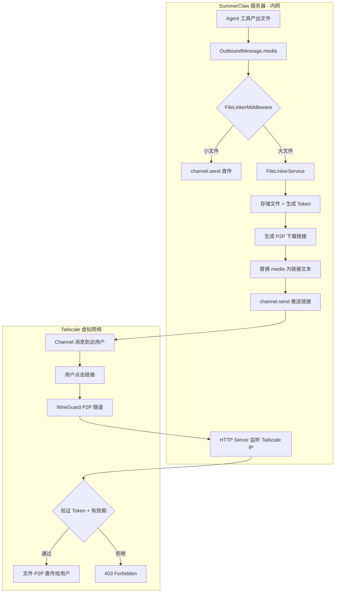
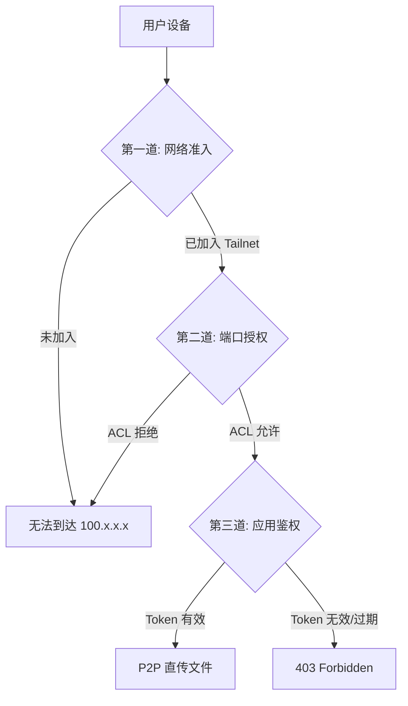
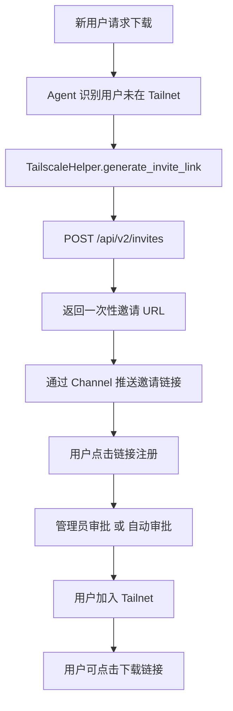
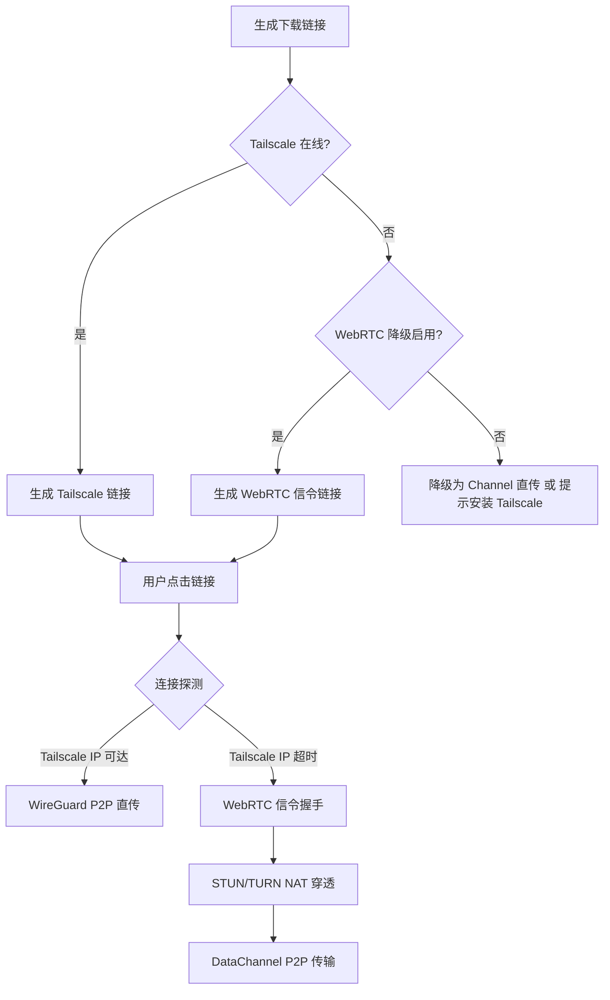
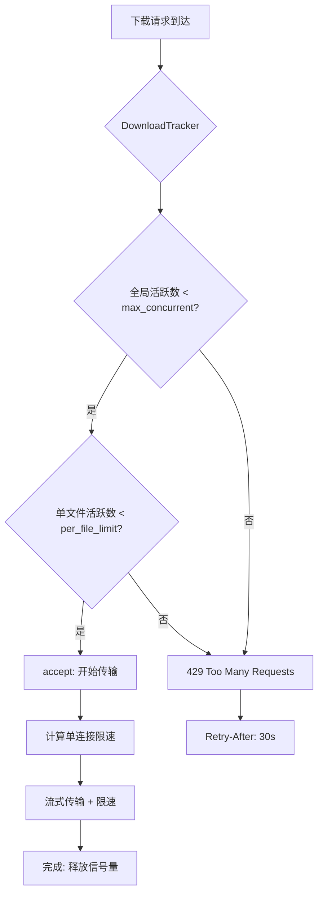
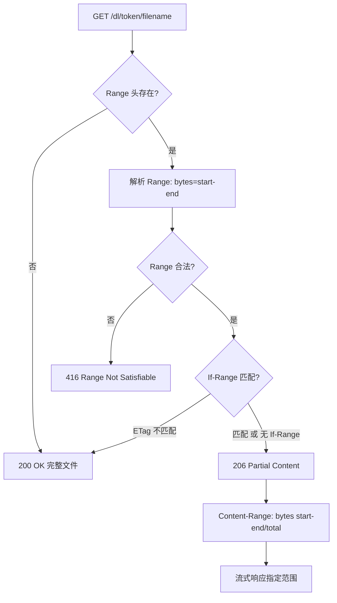
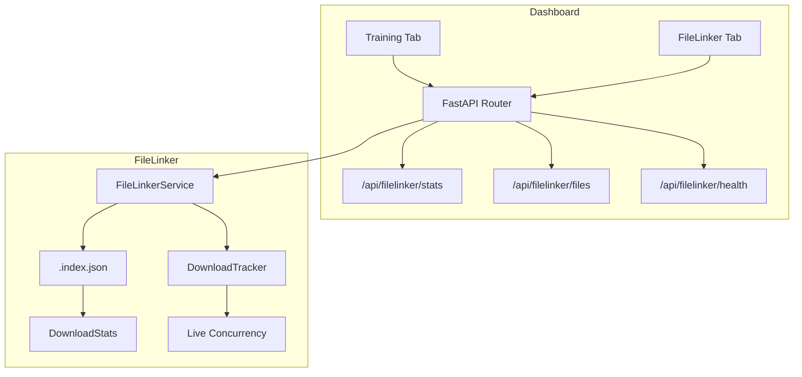

# FileLinker — P2P 大文件直传方案

## 1. 背景与问题

### 1.1 问题

SummerClaw 各 Channel（Telegram / Discord / QQ / 飞书 / 微信等）推送文件存在平台大小限制（普遍 < 1MB ~ 几十 MB），Agent 生成的较大产物（APK、ZIP、PDF、数据集等）无法直接通过 Channel 推送给用户。

### 1.2 环境约束

| 约束 | 说明 |
|------|------|
| **服务器在内网** | 无公网 IP，无法被外部直接访问 |
| **不允许 VPS** | 不可租用任何公网服务器做中转 |
| **必须 P2P** | 文件数据必须从服务器直传到用户设备，不经过任何第三方中转 |

### 1.3 核心策略

| 文件大小 | 分发方式 | 说明 |
|---------|---------|------|
| < 800 KB | **Channel 直传** | 沿用现有 `channel.send(msg)` 直接发送文件 |
| ≥ 800 KB | **P2P 直传** | 通过 Tailscale 虚拟网络建立 P2P 隧道，用户直接从服务器下载 |

> 800 KB 阈值留出 ~200 KB 余量（消息文本 + 元数据开销），避免卡在平台边界。各 Channel 可配置独立阈值。

---

## 2. 为什么必须是 P2P

```
传统 C/S 模式（不可行）：
  服务器(内网) → [公网服务器中转] → 用户
       ↑              ↑
    无公网 IP      不允许 VPS ❌

P2P 模式（本方案）：
  服务器(内网) ═══[ Tailscale WireGuard 隧道 ]═══→ 用户设备
       ↑                   ↑                          ↑
    100.x.x.x        数据 P2P 直传              100.y.y.y
                   无第三方中转 ✅
```

**Tailscale 的角色：仅负责"打通网络"（NAT 穿透 + 路由），不参与数据传输的中转。** 文件数据通过 WireGuard 加密隧道在两台设备的网卡之间直接流动，是真正的 P2P。

---

## 3. 架构总览

### 3.1 整体数据流



### 3.2 C/S vs P2P 架构对比

| 维度 | C/S 模式（旧方案） | P2P 模式（本方案） |
|------|-------------------|-------------------|
| **数据路径** | 用户 → 公网服务器 → 文件 | 用户 ←→ 服务器（WireGuard 直连） |
| **网络依赖** | 需要公网 IP 或 VPS | 仅需 Tailscale（免费） |
| **内网穿透** | 需要 frp/ngrok 等 | Tailscale 内置 NAT 穿透 |
| **传输速度** | 受限于公网服务器带宽 | 跑满两端设备的上行带宽 |
| **数据安全** | 数据经过第三方 | 数据端到端加密，不离开两台设备 |
| **用户门槛** | 点击链接即可（零门槛） | 需安装 Tailscale（一次性） |

---

## 4. P2P 网络层设计（Tailscale）

### 4.1 Tailscale 工作原理

```
  服务器 (内网, 192.168.1.100)          用户设备 (任意网络, 192.168.0.50)
  ┌──────────────────────┐           ┌──────────────────────┐
  │ Tailscale IP: 100.64.0.1        │ Tailscale IP: 100.64.0.2
  │                      │           │                      │
  │  WireGuard ◄─────────┼──P2P隧道──┼─────────► WireGuard  │
  │  (内核态)            │           │            (内核态)   │
  └──────────────────────┘           └──────────────────────┘
  
  数据传输路径（P2P）:
  100.64.0.1:8090 ←═══ WireGuard 加密隧道 ═══→ 100.64.0.2:随机端口
  
  ⚠ Tailscale 协调服务器仅用于初始握手和 NAT 穿透
  ⚠ 握手完成后，数据在两台设备间直连，不经过 Tailscale 服务器
```

### 4.2 服务器端设置（一次性）

#### 4.2.1 安装 Tailscale

**Linux（Ubuntu / Debian / CentOS / RHEL）：**

```bash
curl -fsSL https://tailscale.com/install.sh | sh
```

**macOS：**

```bash
brew install tailscale
# 或从 Mac App Store 安装 Tailscale GUI 客户端
```

**Windows：** 从 [Microsoft Store](https://www.microsoft.com/store/productId/9PJKXPWJQ4P9) 安装，或 `winget install tailscale`。

**其他平台：** 访问 https://login.tailscale.com/download 获取对应客户端。

#### 4.2.2 加入 Tailnet

```bash
# 交互式登录（首次会弹出浏览器进行 OAuth 认证）
sudo tailscale up

# 或使用 authkey 无头加入（CI / 服务器推荐）
sudo tailscale up --authkey tskey-auth-XXXXX --advertise-tags=tag:file-server
```

#### 4.2.3 验证连接

```bash
# 查看分配的 Tailscale IP（100.x.x.x）
tailscale ip -4

# 查看 Tailscale 服务状态
tailscale status

# 查看 Tailnet 中其他设备
tailscale status --peers
```

#### 4.2.4 设为开机自启（systemd）

```bash
sudo systemctl enable --now tailscaled
```

#### 4.2.5 故障排查

| 现象 | 排查命令 | 解决方法 |
|------|----------|----------|
| `tailscale` 命令不存在 | `which tailscale` | 重新执行安装脚本 |
| `tailscaled` 服务未运行 | `systemctl status tailscaled` | `sudo systemctl start tailscaled` |
| 未获取到 100.x IP | `tailscale ip -4` 返回空 | `sudo tailscale up` 重新登录 |
| 能 ping 通但 HTTP 不通 | `curl http://100.x.x.x:8090/health` | 检查防火墙 `iptables -L INPUT -n` 是否拦截 8090 端口 |

> **Gateway 启动行为**：当 `fileLinker.enabled=true` 但 Tailscale 未运行时，Gateway 会向所有已启用的 Channel 推送警告消息，告知用户大文件 P2P 传输暂不可用。

### 4.3 用户端设置（一次性）

```bash
# 1. 安装 Tailscale（各平台均有客户端）
# macOS: brew install tailscale
# Windows: 从 Microsoft Store 安装
# Android/iOS: 从应用商店安装
# Linux: curl -fsSL https://tailscale.com/install.sh | sh

# 2. 登录同一个 Tailnet
tailscale up

# 3. 验证连通性
ping 100.64.0.1    # 能 ping 通 = P2P 隧道已建立
```

### 4.4 Tailscale ACL 配置（管理员一次性设置）

在 [Tailscale 管理后台](https://login.tailscale.com/admin/acls) 配置最小权限策略：

```json
{
  "tagOwners": {
    "tag:file-server": ["autogroup:admin"]
  },
  "acls": [
    {
      "action": "accept",
      "src": ["autogroup:member"],
      "dst": ["tag:file-server:8090"]
    }
  ]
}
```

> **效果**：只有被审批加入 Tailnet 的成员，才能访问 `tag:file-server` 设备的 8090 端口。其他所有访问被默认拒绝。

---

## 5. FileLinker 模块设计

### 5.1 目录结构

```
summerclaw/filelinker/
├── __init__.py           # 导出 FileLinkerService
├── service.py            # 核心服务：Token 生成/验证、链接管理、生命周期
├── server.py             # HTTP 下载服务（仅监听 Tailscale IP）
├── models.py             # 数据模型：FileLinkToken 元数据
├── middleware.py          # ChannelManager 集成钩子
└── tailscale.py          # Tailscale 集成工具（获取 IP、健康检查）
```

### 5.2 配置 Schema

在 `config/schema.py` 的 `Config` 中新增 `FileLinkerConfig`：

```python
class FileLinkerConfig(Base):
    """FileLinker P2P 大文件直传配置。"""

    enabled: bool = False                     # 全局开关
    port: int = 8090                          # HTTP 服务监听端口
    tailscale_ip: str = ""                    # Tailscale IP（空 = 自动检测）
    token_ttl_hours: int = Field(default=24, ge=1, le=168)  # 链接有效期（小时）
    max_file_size_mb: int = Field(default=500, ge=1)        # 单文件大小上限
    storage_dir: str = ""                     # 文件存储目录（默认 workspace/filelinker_storage/）
    cleanup_interval_hours: int = Field(default=6, ge=1)    # 过期清理周期
    max_concurrent_downloads: int = Field(default=5, ge=1)  # 同时下载连接数（P2P 受限于上行带宽）
    channel_thresholds: dict[str, int] = Field(
        default_factory=lambda: {
            "telegram": 800_000,
            "discord":  800_000,
            "qq":       800_000,
            "whatsapp": 800_000,
            "feishu":   800_000,
            "email":    800_000,
            "default":  800_000,
        }
    )
```

对应 `config.example.json` 新增：

```json
{
  "fileLinker": {
    "enabled": true,
    "port": 8090,
    "tailscaleIp": "",
    "tokenTtlHours": 24,
    "maxFileSizeMb": 500,
    "storageDir": "",
    "cleanupIntervalHours": 6,
    "maxConcurrentDownloads": 5,
    "channelThresholds": {
      "telegram": 800000,
      "discord": 800000,
      "default": 800000
    }
  }
}
```

### 5.3 Tailscale 集成工具 (`tailscale.py`)

```python
class TailscaleHelper:
    """Tailscale 集成工具，提供 IP 自动检测和健康检查。"""

    @staticmethod
    def get_tailscale_ip() -> str | None:
        """
        自动检测本机的 Tailscale IPv4 地址。
        方式 1: 读取环境变量 TAILSCALE_IP
        方式 2: 解析 `tailscale ip -4` 命令输出
        方式 3: 遍历网卡名匹配 "tailscale" 前缀的接口
        返回 None 表示 Tailscale 未运行。
        """
        ...

    @staticmethod
    async def health_check() -> dict:
        """
        检查 Tailscale 连通性：
        - Tailscale 是否运行
        - 是否已登录
        - 当前 Tailnet 中的在线设备数
        返回 {"running": bool, "ip": str, "peers": int}
        """
        ...
```

### 5.4 数据模型 (`models.py`)

```python
@dataclass
class FileLinkToken:
    """一个 P2P 下载链接的完整元数据。"""

    token: str              # 随机令牌（URL-safe，32 字符）
    file_path: str          # 文件在 storage_dir 下的绝对路径
    original_name: str      # 原始文件名
    file_size: int          # 文件大小（字节）
    content_type: str       # MIME 类型
    channel: str            # 来源 channel
    chat_id: str            # 来源 chat_id
    created_at: float       # 创建时间戳
    expires_at: float       # 过期时间戳
    download_count: int     # 已下载次数
    max_downloads: int      # 最大下载次数（0 = 不限）
```

### 5.5 核心服务 (`service.py`) — `FileLinkerService`

```python
class FileLinkerService:
    """FileLinker 核心服务。"""

    def __init__(self, config: FileLinkerConfig, workspace: Path):
        self.config = config
        self.storage_dir = Path(config.storage_dir) or workspace / "filelinker_storage"
        self._tokens: dict[str, FileLinkToken] = {}
        self._tailscale_ip = config.tailscale_ip or TailscaleHelper.get_tailscale_ip()
        self._lock = asyncio.Lock()

    def should_use_link(self, channel: str, file_path: str) -> bool:
        """判断文件是否应走 P2P 链接分发。"""
        ...

    async def create_link(
        self,
        file_path: str,
        original_name: str,
        channel: str,
        chat_id: str,
        max_downloads: int = 0,
    ) -> str:
        """
        1. 复制文件到 storage_dir/{token}/{original_name}
        2. 生成安全随机 token（secrets.token_urlsafe(24)）
        3. 记录 FileLinkToken 元数据
        4. 返回 P2P 下载 URL:
           http://{tailscale_ip}:{port}/dl/{token}/{filename}
        """
        ...

    async def validate_token(self, token: str) -> FileLinkToken | None:
        """验证 token（存在 + 未过期 + 未超下载次数）。"""
        ...

    async def cleanup_expired(self) -> int:
        """清理过期 token 及文件。"""
        ...
```

**URL 格式（关键差异 — 使用 Tailscale IP 而非公网域名）：**

```
http://100.64.0.1:8090/dl/{token}/{filename}
       ^^^^^^^^^^       ^^^^^^^^^^^^^^^^^^^^
       Tailscale IP     Token + 原始文件名
       (仅 Tailnet      (鉴权 + 友好显示)
        内可达)
```

### 5.6 HTTP 下载服务 (`server.py`)

```python
# 关键：仅绑定 Tailscale IP，拒绝非 Tailnet 来源
# 即使端口被扫描，非 Tailnet 设备无法路由到 100.x.x.x

server_config = uvicorn.Config(
    app=app,
    host=tailscale_ip,    # ← 仅监听 Tailscale 网卡 IP，非 0.0.0.0
    port=8090,
)
```

**下载流程：**

```
GET http://100.64.0.1:8090/dl/{token}/{filename}
    │
    │  ← 只有 Tailnet 成员才能路由到 100.64.0.1（网络层隔离）
    │
    ├── 1. validate_token(token)
    │       ├── None → 403 Forbidden
    │       └── OK → 继续
    │
    ├── 2. 安全校验
    │       ├── filename 与 token_meta.original_name 比对
    │       └── file_path 必须在 storage_dir 下（realpath 检查）
    │
    ├── 3. record_download(token)
    │
    └── 4. 流式响应（数据通过 WireGuard 隧道 P2P 直传）
            ├── Content-Type: token_meta.content_type
            ├── Content-Disposition: attachment; filename="{original_name}"
            ├── Content-Length: token_meta.file_size
            └── Body: StreamingResponse（8KB chunks）
```

### 5.7 ChannelManager 集成 (`middleware.py`)

与现有架构的集成方式不变 — 在 `_send_once()` 前拦截：

```python
class FileLinkerMiddleware:
    """拦截 OutboundMessage，将大文件替换为 P2P 下载链接。"""

    _service: FileLinkerService | None = None

    @classmethod
    async def intercept(cls, msg: OutboundMessage, channel: BaseChannel) -> OutboundMessage:
        if not cls._service or not cls._service.config.enabled:
            return msg
        if not msg.media:
            return msg

        remaining_media = []
        link_texts = []

        for media_path in msg.media:
            if cls._service.should_use_link(channel.name, media_path):
                link_url = await cls._service.create_link(
                    file_path=media_path,
                    original_name=os.path.basename(media_path),
                    channel=msg.channel,
                    chat_id=msg.chat_id,
                )
                link_texts.append(
                    f"📎 [{os.path.basename(media_path)}]({link_url}) "
                    f"({format_size(cls._service.get_file_size(media_path))})"
                )
            else:
                remaining_media.append(media_path)

        new_content = msg.content
        if link_texts:
            link_block = "\n".join(link_texts)
            new_content = f"{msg.content}\n\n{link_block}" if msg.content else link_block

        return OutboundMessage(
            channel=msg.channel, chat_id=msg.chat_id,
            content=new_content, reply_to=msg.reply_to,
            media=remaining_media, metadata=msg.metadata,
        )
```

**`ChannelManager._send_once()` 修改：**

```python
@staticmethod
async def _send_once(channel: BaseChannel, msg: OutboundMessage) -> None:
    if msg.metadata.get("_stream_delta") or msg.metadata.get("_stream_end"):
        await channel.send_delta(msg.chat_id, msg.content, msg.metadata)
    elif not msg.metadata.get("_streamed"):
        msg = await FileLinkerMiddleware.intercept(msg, channel)  # ← P2P 拦截
        await channel.send(msg)
```

---

## 6. 安全设计（三道防线）

### 6.1 防线总览



| 防线 | 层级 | 机制 | 作用 |
|------|------|------|------|
| **第一道** | 网络层 | Tailscale 准入 | 只有被邀请 + 审批的设备才能加入 Tailnet |
| **第二道** | 网络层 | Tailscale ACL | 成员只能访问 `tag:file-server` 的 8090 端口 |
| **第三道** | 应用层 | Token 鉴权 | 每个下载链接携带唯一随机 Token，24h 过期 |

### 6.2 为什么比公网 HTTP 服务更安全

| 威胁 | 公网 HTTP 服务器 | 本方案（Tailscale P2P） |
|------|-----------------|----------------------|
| 端口扫描 | 公网 IP 可被扫描 | 100.x.x.x 不可路由，扫描不到 |
| DDoS | 公网暴露，易受攻击 | 仅 Tailnet 成员可达，天然免疫 |
| 中间人攻击 | 需 HTTPS + 证书 | WireGuard 端到端加密，无需证书 |
| Token 泄露 | 任何人拿到链接都能下载 | 非 Tailnet 成员无法访问 100.x.x.x |
| 数据窃听 | 需 TLS 加密 | WireGuard 内置 ChaCha20 加密 |

### 6.3 防滥用措施

| 威胁 | 防护 |
|------|------|
| 暴力猜测 Token | 32 字符 URL-safe Base64 → 2^192 种可能 |
| 路径遍历攻击 | `realpath` 校验 + 禁止 `..` + 禁止 symlink |
| 重复下载滥用 | `max_downloads` 限制 |
| 磁盘耗尽 | 单文件上限 + 定期清理 |
| Tailnet 成员滥用 | Tailscale 管理后台可随时移除设备 |

---

## 7. 生命周期管理

### 7.1 服务启停

```
SummerClaw 主进程启动
    │
    ├── 1. 加载 FileLinkerConfig
    ├── 2. TailscaleHelper.get_tailscale_ip()
    │       ├── 成功 → 记录 100.x.x.x
    │       └── 失败 → 警告日志，FileLinker 降级为 disabled
    ├── 3. 实例化 FileLinkerService
    │       ├── 创建 storage_dir
    │       ├── 从 .index.json 恢复未过期 token
    │       └── 清理已过期文件
    ├── 4. 注入 FileLinkerMiddleware._service
    ├── 5. 启动 HTTP Server（绑定 Tailscale IP :8090）
    └── 6. 启动清理定时任务

SummerClaw 主进程关闭
    │
    ├── 1. 持久化 token 索引到 .index.json
    ├── 2. 关闭 HTTP Server
    └── 3. 清理资源
```

### 7.2 Tailscale 断连处理

```
Tailscale 连接正常 → HTTP Server 正常服务
Tailscale 断连     → HTTP Server 不可达（100.x.x.x 消失）
                    → 新链接无法生成（tailscale_ip 检测失败）
                    → 已有链接暂时不可用
Tailscale 恢复     → HTTP Server 自动恢复（IP 不变）
                    → 已有链接恢复可用
```

> **建议**：`tailscale up` 配合 `systemd` 守护，确保 Tailscale 开机自启 + 断线自动重连。

---

## 8. 各 Channel 适配要点

FileLinker 对 Channel 层**完全透明** — Channel 的 `send()` 收到的 `OutboundMessage` 已被 Middleware 处理：

| Channel | 链接格式 | 注意事项 |
|---------|---------|---------|
| **Telegram** | `<a href="http://100.x.x.x:8090/dl/...">filename</a>` (HTML) | 需 HTML parse_mode |
| **Discord** | 直接发送 URL 文本 | Discord 自动解析 URL |
| **QQ** | Markdown `[filename](url)` | QQ 支持 Markdown 消息 |
| **飞书** | 富文本 `link` 元素 | 需使用飞书卡片消息 |
| **邮件** | HTML `<a>` 标签 | 嵌入邮件正文 |
| **WebSocket** | 无大小限制（阈值设为极大值） | 跳过 FileLinker |

---

## 9. 用户交互示例

### 场景：Agent 生成了一个 15MB 的 APK

```
用户（Telegram）: 帮我编译一个 APK

Agent（内部）:
  → 工具产出 /workspace/output/app.apk (15MB)
  → OutboundMessage(media=["/workspace/output/app.apk"])
  → ChannelManager._send_once()
  → FileLinkerMiddleware.intercept()
    → should_use_link("telegram", ...) → True (15MB > 800KB)
    → create_link()
      → 复制文件到 storage_dir/
      → 生成 token: aBcDeFgHiJkLmNoPqRsTuVwXyZ012345
      → URL: http://100.64.0.1:8090/dl/aBcDeFgHiJkLmNoPqRsTuVwXyZ012345/app.apk
  → 替换 OutboundMessage

用户（Telegram 中收到）:
  📎 app.apk (15.0 MB)
  http://100.64.0.1:8090/dl/aBcDeFgHiJkLmNoPqRsTuVwXyZ012345/app.apk

用户（点击链接）:
  → 浏览器尝试访问 100.64.0.1:8090
  → 如果已安装 Tailscale 并加入 Tailnet → P2P 直传开始下载 ✅
  → 如果未安装 Tailscale → 浏览器超时，提示需加入网络 ⚠️
```

### 场景：新用户首次使用

```
用户: 为什么我打不开下载链接？

Agent:
  下载链接通过 Tailscale 私有网络传输，需要先加入网络：
  1. 安装 Tailscale：https://tailscale.com/download
  2. 点击邀请链接加入网络：https://login.tailscale.com/admin/invite/xxx
  3. 等待管理员审批后即可下载
  
  这是一次性设置，之后所有下载链接可直接打开。
```

---

## 10. 实现任务拆分

### Task 1: Tailscale 集成工具

- [ ] 创建 `summerclaw/filelinker/__init__.py`
- [ ] 实现 `tailscale.py` — `TailscaleHelper`（IP 自动检测、健康检查）
- [ ] 编写 `tests/filelinker/test_tailscale.py`

### Task 2: 基础模块

- [ ] 实现 `models.py` — `FileLinkToken` 数据类
- [ ] 实现 `service.py` — `FileLinkerService`（Token 生命周期、文件管理）
- [ ] 编写 `tests/filelinker/test_service.py`

### Task 3: HTTP 下载服务

- [ ] 实现 `server.py` — Starlette 路由 + 绑定 Tailscale IP + 流式下载
- [ ] 编写 `tests/filelinker/test_server.py`

### Task 4: 配置集成

- [ ] 在 `config/schema.py` 新增 `FileLinkerConfig`
- [ ] 在 `Config` 类添加 `file_linker: FileLinkerConfig` 字段
- [ ] 更新 `config.example.json` 添加 `fileLinker` 段

### Task 5: ChannelManager 拦截层

- [ ] 实现 `middleware.py` — `FileLinkerMiddleware.intercept()`
- [ ] 修改 `ChannelManager._send_once()` — 插入拦截
- [ ] 修改 `ChannelManager.start_all()` — 启动 HTTP Server + 清理任务
- [ ] 修改 `ChannelManager.stop_all()` — 持久化 + 关闭
- [ ] 编写 `tests/filelinker/test_middleware.py`

### Task 6: 链接格式适配

- [ ] Telegram HTML `<a>` 标签
- [ ] Discord/QQ Markdown 链接
- [ ] 飞书富文本 link 元素
- [ ] 编写对应测试

### Task 7: 运维与监控

- [ ] Tailscale 健康检查 + 断连告警
- [ ] 过期文件自动清理
- [ ] `.index.json` 持久化与恢复
- [ ] 启动时 Tailscale IP 自动检测 + 日志

---

## 11. 技术选型

| 组件 | 选型 | 理由 |
|------|------|------|
| **P2P 网络** | **Tailscale (WireGuard)** | 零配置 NAT 穿透、内核态加密、免费层支持 100 设备 |
| **HTTP 框架** | **Starlette + uvicorn** | 轻量异步，项目已有依赖 |
| **Token 生成** | **Python `secrets` 标准库** | 密码学安全 |
| **文件存储** | **本地文件系统** | 简单可靠 |
| **MIME 检测** | **`mimetypes` 标准库** | 零额外依赖 |
| **元数据持久化** | **JSON 文件** (`.index.json`) | 轻量、人类可读 |
| **定时清理** | **`asyncio` 后台任务** | 与主事件循环集成 |

---

## 12. 扩展功能

### 12.1 自动邀请（Auto Invite）

**目标**：Agent 可通过 Tailscale API 自动生成一次性邀请链接，推送给新用户，免去管理员手动操作。

#### 12.1.1 架构设计



#### 12.1.2 核心 API

```python
class TailscaleHelper:
    # ... 现有方法 ...

    @staticmethod
    async def generate_invite_link(
        api_key: str,
        tailnet: str,
        tags: list[str] | None = None,
        reusable: bool = False,
    ) -> str:
        """
        调用 Tailscale API 生成邀请链接。
        POST https://api.tailscale.com/api/v2/tailnet/{tailnet}/invites
        Headers: Authorization: Bearer {api_key}
        Body: { "reusable": false, "tags": ["tag:member"] }
        返回: 一次性邀请 URL（Tailscale 服务端生成）
        """
        ...
```

#### 12.1.3 配置扩展

```python
class FileLinkerConfig(Base):
    # ... 现有字段 ...
    auto_invite_enabled: bool = False            # 自动邀请开关
    tailscale_api_key: str = ""                  # Tailscale API Key（环境变量优先）
    tailscale_tailnet: str = ""                  # Tailnet 名称（如 user@example.com）
    auto_approve: bool = False                   # 自动审批（默认关闭，需管理员手动审批）
    invite_ttl_hours: int = Field(default=24, ge=1, le=168)  # 邀请链接有效期
```

#### 12.1.4 Agent 工具暴露

```python
# 新增 Agent 工具：filelinker_invite
# 当 Agent 检测到用户无法访问下载链接时，自动调用此工具

async def filelinker_invite(user_id: str, channel: str) -> str:
    """
    为指定用户生成 Tailscale 邀请链接。
    返回: "已向用户推送邀请链接: https://login.tailscale.com/admin/invite/xxx"
    """
    link = await TailscaleHelper.generate_invite_link(
        api_key=config.tailscale_api_key,
        tailnet=config.tailscale_tailnet,
        tags=["tag:member"],
    )
    # 记录邀请日志，关联 user_id
    await invite_logger.log(user_id=user_id, invite_url=link, channel=channel)
    return link
```

#### 12.1.5 安全措施

| 威胁 | 防护 |
|------|------|
| 邀请链接滥用 | `reusable=false` 单次使用 + TTL 限制 |
| API Key 泄露 | 环境变量注入，不写入配置文件 |
| 未授权设备加入 | `auto_approve=false` 默认需管理员审批 |
| 大量恶意邀请 | 速率限制：同一 `user_id` 24h 内最多 3 次邀请 |

#### 12.1.6 实现任务

- [ ] `tailscale.py` 新增 `generate_invite_link()` 方法
- [ ] `FileLinkerConfig` 新增 4 个配置字段
- [ ] 实现 Agent 工具 `filelinker_invite`
- [ ] 新增 `InviteLogger` 记录邀请审计日志
- [ ] 编写 `tests/filelinker/test_auto_invite.py`

---

### 12.2 WebRTC 备选通道

**目标**：为未安装 Tailscale 的用户提供 WebRTC DataChannel 降级通道，降低使用门槛。

#### 12.2.1 双通道策略



#### 12.2.2 信令通道设计

复用现有 Gateway 端口（18790）作为 WebRTC 信令通道：

```
信令流程:
  用户浏览器 ──WebSocket──► Gateway :18790/ws/filelinker/signal
                                │
                                ├── 1. 用户发送 offer（SDP）
                                ├── 2. 服务端返回 answer（SDP）
                                ├── 3. 双方交换 ICE candidates
                                └── 4. DataChannel 建立 → P2P 传输开始
```

#### 12.2.3 新增模块

```
summerclaw/filelinker/
├── ...（现有文件）
└── webrtc.py          # WebRTC DataChannel 传输引擎
```

```python
# webrtc.py

class WebRTCTransporter:
    """WebRTC DataChannel 文件传输引擎。"""

    def __init__(self, stun_servers: list[str]):
        self.stun_servers = stun_servers
        self._pc: RTCPeerConnection | None = None

    async def create_offer(self) -> RTCSessionDescription:
        """创建 SDP offer，配置 DataChannel。"""
        ...

    async def handle_answer(self, sdp: str) -> None:
        """处理远端 answer，完成 ICE 协商。"""
        ...

    async def send_file(self, file_path: str, progress_cb=None) -> None:
        """通过 DataChannel 流式发送文件（64KB chunks）。"""
        ...

    async def close(self) -> None:
        """关闭 PeerConnection。"""
        ...
```

#### 12.2.4 配置扩展

```python
class FileLinkerConfig(Base):
    # ... 现有字段 ...
    webrtc_fallback: bool = False                # WebRTC 降级开关
    stun_servers: list[str] = Field(
        default_factory=lambda: [
            "stun:stun.l.google.com:19302",
            "stun:stun1.l.google.com:19302",
        ]
    )
    webrtc_max_file_size_mb: int = Field(default=100, ge=1)  # WebRTC 文件大小上限
    signal_path: str = "/ws/filelinker/signal"   # 信令 WebSocket 路径
```

#### 12.2.5 连接探测逻辑

```python
async def resolve_transport(self, client_info: dict) -> str:
    """
    探测最佳传输通道：
    1. 尝试 ping Tailscale IP（1s 超时）
    2. 可达 → 返回 "tailscale"
    3. 不可达 + webrtc_fallback=true → 返回 "webrtc"
    4. 不可达 + webrtc_fallback=false → 返回 "none"
    """
    try:
        await asyncio.wait_for(
            asyncio.create_subprocess_exec("ping", "-c", "1", tailscale_ip),
            timeout=1.0,
        )
        return "tailscale"
    except (asyncio.TimeoutError, OSError):
        if self.config.webrtc_fallback:
            return "webrtc"
        return "none"
```

#### 12.2.6 安全考量

| 维度 | Tailscale 通道 | WebRTC 通道 |
|------|---------------|-------------|
| **加密** | WireGuard 内置 ChaCha20 | DTLS-SRTP（浏览器强制） |
| **身份验证** | Tailnet 成员身份 | Token + 信令通道鉴权 |
| **NAT 穿透** | Tailscale DERP 中继 | STUN/TURN |
| **信任等级** | 高（预审批） | 中（需额外验证） |

> WebRTC 通道安全性低于 Tailscale，建议仅作为临时降级方案，同时提示用户安装 Tailscale 获得最佳体验。

#### 12.2.7 实现任务

- [ ] 新增 `webrtc.py` — `WebRTCTransporter` 类
- [ ] `server.py` 新增信令 WebSocket 端点 `/ws/filelinker/signal`
- [ ] `FileLinkerConfig` 新增 4 个配置字段
- [ ] `service.py` 新增 `resolve_transport()` 连接探测
- [ ] 前端：浏览器端 WebRTC 客户端（JavaScript）
- [ ] `pyproject.toml` 新增可选依赖 `webrtc = ["aiortc>=1.6.0"]`
- [ ] 编写 `tests/filelinker/test_webrtc.py`

---

### 12.3 多用户并发下载

**目标**：支持多个用户同时 P2P 下载同一文件，各自独立隧道，带并发控制与公平限速。

#### 12.3.1 并发控制模型



#### 12.3.2 DownloadTracker

```python
class DownloadTracker:
    """追踪活跃下载连接，提供并发控制与统计。"""

    def __init__(
        self,
        max_concurrent: int = 5,
        per_file_limit: int = 3,
    ):
        self._global_sem = asyncio.Semaphore(max_concurrent)
        self._file_counts: dict[str, asyncio.Semaphore] = {}
        self._active: dict[str, DownloadSession] = {}
        self._per_file_limit = per_file_limit

    async def acquire(self, token: str, file_path: str) -> bool:
        """
        尝试获取下载许可。
        返回 True = 允许下载，False = 需排队。
        """
        if not self._global_sem._value:
            return False  # 全局已满
        if token in self._file_counts:
            sem = self._file_counts[token]
        else:
            sem = asyncio.Semaphore(self._per_file_limit)
            self._file_counts[token] = sem
        if not sem._value:
            return False  # 单文件已满
        await self._global_sem.acquire()
        await sem.acquire()
        return True

    def release(self, token: str) -> None:
        """释放下载许可。"""
        self._global_sem.release()
        if token in self._file_counts:
            self._file_counts[token].release()

    @property
    def active_count(self) -> int:
        return len(self._active)

    def get_stats(self) -> dict:
        """返回当前并发状态快照。"""
        return {
            "active_downloads": self.active_count,
            "max_concurrent": self._global_sem._value + self.active_count,
            "available_slots": self._global_sem._value,
        }
```

#### 12.3.3 配置扩展

```python
class FileLinkerConfig(Base):
    # ... 现有字段 ...
    # max_concurrent_downloads 已有（全局上限）
    per_file_concurrent_limit: int = Field(default=3, ge=1)  # 单文件并发上限
    bandwidth_limit_mbps: int = Field(default=0, ge=0)       # 总上行带宽限制（0=不限）
    queue_retry_after_seconds: int = Field(default=30, ge=5)  # 排队重试等待时间
```

#### 12.3.4 带宽公平性

```python
def calculate_per_connection_limit(self) -> int | None:
    """
    计算单连接限速（字节/秒）。
    公式: 总带宽 / 当前活跃连接数
    返回 None 表示不限速。
    """
    if self.config.bandwidth_limit_mbps == 0:
        return None
    total_bps = self.config.bandwidth_limit_mbps * 1024 * 1024 // 8
    active = self._tracker.active_count or 1
    return total_bps // active
```

#### 12.3.5 HTTP 429 响应

```python
# server.py 下载端点修改

@routes.get("/dl/{token}/{filename}")
async def download(request):
    # ... token 验证 ...
    if not await tracker.acquire(token, file_path):
        return Response(
            status_code=429,
            content="Too many concurrent downloads. Please retry later.",
            headers={
                "Retry-After": str(config.queue_retry_after_seconds),
                "X-Active-Downloads": str(tracker.active_count),
                "X-Max-Concurrent": str(config.max_concurrent_downloads),
            },
        )
    try:
        # ... 流式传输 ...
    finally:
        tracker.release(token)
```

#### 12.3.6 实现任务

- [ ] 新增 `DownloadTracker` 类（可放在 `service.py` 或独立 `tracker.py`）
- [ ] `server.py` 下载端点集成并发控制
- [ ] 新增带宽限速逻辑（令牌桶算法）
- [ ] `FileLinkerConfig` 新增 3 个配置字段
- [ ] 编写 `tests/filelinker/test_concurrent_download.py`

---

### 12.4 断点续传（HTTP Range）

**目标**：支持 HTTP Range 请求，网络不稳定时用户可从断点续传，无需重新下载。

#### 12.4.1 Range 请求处理流程



#### 12.4.2 Range 解析实现

```python
from dataclasses import dataclass

@dataclass
class ByteRange:
    start: int
    end: int  # inclusive
    total: int

    @property
    def length(self) -> int:
        return self.end - self.start + 1

    @property
    def content_range_header(self) -> str:
        return f"bytes {self.start}-{self.end}/{self.total}"


def parse_range_header(range_header: str, file_size: int) -> ByteRange | None:
    """
    解析 Range 头。
    支持格式:
      - bytes=0-499       (前 500 字节)
      - bytes=500-999     (第 500-999 字节)
      - bytes=-500        (最后 500 字节)
      - bytes=500-        (从第 500 字节到末尾)
    返回 None 表示格式不合法。
    """
    if not range_header.startswith("bytes="):
        return None
    range_spec = range_header[6:].strip()
    if "-" not in range_spec:
        return None

    start_str, end_str = range_spec.split("-", 1)

    if start_str == "":
        # bytes=-500 → 最后 500 字节
        suffix_len = int(end_str)
        start = max(0, file_size - suffix_len)
        end = file_size - 1
    elif end_str == "":
        # bytes=500- → 从 500 到末尾
        start = int(start_str)
        end = file_size - 1
    else:
        start = int(start_str)
        end = min(int(end_str), file_size - 1)

    if start > end or start >= file_size:
        return None

    return ByteRange(start=start, end=end, total=file_size)
```

#### 12.4.3 ETag 生成

```python
import hashlib
from pathlib import Path

def generate_etag(file_path: Path) -> str:
    """
    基于文件 inode + size + mtime 生成弱 ETag。
    比计算文件哈希快得多，且足够标识文件版本。
    """
    stat = file_path.stat()
    key = f"{stat.st_ino}:{stat.st_size}:{stat.st_mtime_ns}"
    return f'W/"{hashlib.md5(key.encode()).hexdigest()[:16]}"'
```

#### 12.4.4 下载端点集成

```python
@routes.get("/dl/{token}/{filename}")
async def download(request):
    # ... token 验证 + 安全校验 ...

    file_path = Path(token_meta.file_path)
    file_size = file_path.stat().st_size
    etag = generate_etag(file_path)

    # If-Range 条件检查
    if_range = request.headers.get("If-Range")
    if if_range and if_range != etag:
        # 文件已变更，返回完整文件
        return await stream_full_file(file_path, token_meta)

    # Range 处理
    range_header = request.headers.get("Range")
    if range_header:
        byte_range = parse_range_header(range_header, file_size)
        if byte_range is None:
            return Response(
                status_code=416,
                headers={"Content-Range": f"bytes */{file_size}"},
            )

        return StreamingResponse(
            content=stream_file_range(file_path, byte_range.start, byte_range.end),
            status_code=206,
            headers={
                "Content-Range": byte_range.content_range_header,
                "Content-Length": str(byte_range.length),
                "Accept-Ranges": "bytes",
                "ETag": etag,
                "Content-Type": token_meta.content_type,
                "Content-Disposition": f'attachment; filename="{token_meta.original_name}"',
            },
        )

    # 无 Range → 完整下载
    return StreamingResponse(
        content=stream_file_range(file_path, 0, file_size - 1),
        headers={
            "Content-Length": str(file_size),
            "Accept-Ranges": "bytes",
            "ETag": etag,
            "Content-Type": token_meta.content_type,
            "Content-Disposition": f'attachment; filename="{token_meta.original_name}"',
        },
    )


async def stream_file_range(file_path: Path, start: int, end: int, chunk_size: int = 8192):
    """流式读取文件指定范围。"""
    async with aiofiles.open(file_path, "rb") as f:
        await f.seek(start)
        remaining = end - start + 1
        while remaining > 0:
            read_size = min(chunk_size, remaining)
            data = await f.read(read_size)
            if not data:
                break
            remaining -= len(data)
            yield data
```

#### 12.4.5 安全考量

- Range 解析必须校验 `start <= end < file_size`，防止越界读取
- `416 Range Not Satisfiable` 响应不泄露文件内容
- ETag 使用弱标签（`W/"..."`），避免暴露精确文件信息

#### 12.4.6 实现任务

- [ ] 新增 `ByteRange` 数据类 + `parse_range_header()` 函数
- [ ] 新增 `generate_etag()` 函数
- [ ] `server.py` 下载端点集成 Range 处理逻辑
- [ ] 新增 `stream_file_range()` 范围流式读取
- [ ] 编写 `tests/filelinker/test_range_download.py`（含边界用例）

---

### 12.5 下载统计面板（Dashboard 集成）

**目标**：将 FileLinker 运行状态集成到现有 Gradio Dashboard（7860 端口），提供可视化监控。

#### 12.5.1 集成架构



#### 12.5.2 统计数据模型

```python
# models.py 新增

@dataclass
class DownloadStats:
    """FileLinker 运行统计。"""
    total_links_created: int        # 累计创建链接数
    total_downloads: int            # 累计下载次数
    active_links: int               # 当前有效链接数
    active_downloads: int           # 当前活跃下载数
    total_bytes_served: int         # 累计传输字节数
    storage_used_bytes: int         # 当前存储占用
    tailscale_healthy: bool         # Tailscale 连通状态
    uptime_seconds: float           # 服务运行时长

@dataclass
class FileLinkInfo:
    """单个文件链接的详情（供面板展示）。"""
    token: str                      # Token（脱敏显示前8位）
    original_name: str              # 文件名
    file_size: int                  # 文件大小
    channel: str                    # 来源 Channel
    created_at: float               # 创建时间
    expires_at: float               # 过期时间
    download_count: int             # 下载次数
    is_expired: bool                # 是否已过期
```

#### 12.5.3 FastAPI REST 端点

```python
# 新增路由（挂载到现有 Dashboard FastAPI）

def create_filelinker_api(service: FileLinkerService) -> APIRouter:
    router = APIRouter(prefix="/api/filelinker", tags=["filelinker"])

    @router.get("/stats")
    async def get_stats() -> dict:
        """返回 FileLinker 运行统计。"""
        stats = await service.get_stats()
        return {
            "total_links_created": stats.total_links_created,
            "total_downloads": stats.total_downloads,
            "active_links": stats.active_links,
            "active_downloads": stats.active_downloads,
            "total_bytes_served_mb": round(stats.total_bytes_served / 1048576, 2),
            "storage_used_mb": round(stats.storage_used_bytes / 1048576, 2),
            "tailscale_healthy": stats.tailscale_healthy,
            "uptime_hours": round(stats.uptime_seconds / 3600, 1),
        }

    @router.get("/files")
    async def list_files(
        limit: int = 50,
        offset: int = 0,
        expired: bool | None = None,
    ) -> dict:
        """返回文件链接列表（分页）。"""
        files = await service.list_links(limit=limit, offset=offset, expired=expired)
        return {"files": [asdict(f) for f in files], "total": len(files)}

    @router.get("/health")
    async def health_check() -> dict:
        """Tailscale + FileLinker 健康状态。"""
        ts_health = await TailscaleHelper.health_check()
        return {
            "tailscale": ts_health,
            "filelinker": {
                "enabled": service.config.enabled,
                "storage_dir": str(service.storage_dir),
                "active_links": len(service._tokens),
            },
        }

    return router
```

#### 12.5.4 Gradio UI 设计

```python
def _create_filelinker_tab(service: FileLinkerService):
    """在 Dashboard 中新增 FileLinker Tab 页。"""
    with gr.Tab("FileLinker"):
        with gr.Row():
            # 状态卡片
            with gr.Column(scale=1):
                ts_status = gr.Label(label="Tailscale 状态")
                active_links = gr.Number(label="活跃链接", value=0)
                active_downloads = gr.Number(label="活跃下载", value=0)
            with gr.Column(scale=1):
                total_downloads = gr.Number(label="累计下载", value=0)
                storage_used = gr.Textbox(label="存储占用", value="0 MB")
                uptime = gr.Textbox(label="运行时长", value="0h")

        # 文件列表
        file_table = gr.Dataframe(
            headers=["文件名", "大小", "Channel", "下载次数", "创建时间", "过期时间", "状态"],
            label="文件链接列表",
        )

        # 下载趋势图
        trend_plot = gr.LinePlot(
            label="下载趋势（最近 24h）",
            x="时间", y="下载次数",
        )

        # 自动刷新
        refresh_timer = gr.Timer(5)
        refresh_timer.tick(refresh_filelinker_stats, outputs=[...])
```

**Tab 页布局：**

```
┌──────────────────────────────────────────────────────────┐
│  FileLinker                                              │
├──────────────────────────────────────────────────────────┤
│  ┌─────────────┐  ┌─────────────┐  ┌─────────────────┐  │
│  │ Tailscale   │  │ 活跃链接: 3 │  │ 累计下载: 42    │  │
│  │  ● 在线     │  │ 活跃下载: 1 │  │ 存储: 128 MB    │  │
│  │ 100.64.0.1  │  │             │  │ 运行: 48.5h     │  │
│  └─────────────┘  └─────────────┘  └─────────────────┘  │
│                                                          │
│  文件链接列表                                             │
│  ┌────────┬────────┬────────┬──────┬────────┬──────┬──┐ │
│  │ 文件名  │ 大小   │Channel │ 下载 │ 创建   │ 过期 │状态│ │
│  ├────────┼────────┼────────┼──────┼────────┼──────┼──┤ │
│  │app.apk │ 15 MB  │Telegram│  3   │05-27 10│05-28 │✅ │ │
│  │data.zip│ 82 MB  │Discord │  1   │05-27 08│05-28 │✅ │ │
│  │old.pdf │ 2.1 MB │QQ      │  5   │05-26 14│05-27 │⏰ │ │
│  └────────┴────────┴────────┴──────┴────────┴──────┴──┘ │
│                                                          │
│  下载趋势（最近 24h）                                     │
│  ┌──────────────────────────────────────────────────┐    │
│  │  ╱╲    ╱╲                                        │    │
│  │─╱──╲──╱──╲──────────────────────────────         │    │
│  │ ╱    ╲╱    ╲╱╲                                   │    │
│  └──────────────────────────────────────────────────┘    │
└──────────────────────────────────────────────────────────┘
```

#### 12.5.5 数据持久化

```python
# 扩展现有 .index.json 或新增 .stats.json

class StatsCollector:
    """下载事件收集与持久化。"""

    def __init__(self, storage_dir: Path):
        self._file = storage_dir / ".stats.json"
        self._events: list[dict] = []  # 内存缓冲
        self._flush_interval = 60      # 每 60s 刷盘

    async def record_download(self, token: str, bytes_sent: int, duration_ms: int):
        """记录一次下载事件。"""
        self._events.append({
            "token": token,
            "timestamp": time.time(),
            "bytes_sent": bytes_sent,
            "duration_ms": duration_ms,
        })

    async def flush(self):
        """刷盘到 .stats.json（追加模式）。"""
        if not self._events:
            return
        async with aiofiles.open(self._file, "a") as f:
            for event in self._events:
                await f.write(json.dumps(event) + "\n")
        self._events.clear()

    async def get_trend(self, hours: int = 24) -> list[dict]:
        """读取最近 N 小时的下载趋势数据。"""
        ...
```

#### 12.5.6 与现有 Dashboard 集成

```python
# dashboard/app.py 修改

def _create_gradio(engine, train_root, active_sessions, filelinker_service=None):
    # ... 现有代码 ...

    with gr.Blocks(theme=gr.themes.Soft()) as demo:
        with gr.Tabs():
            # 现有 Tab
            with gr.Tab("Training"):
                # ... 现有训练面板 ...

            # 新增 Tab（仅当 FileLinker 启用时显示）
            if filelinker_service and filelinker_service.config.enabled:
                _create_filelinker_tab(filelinker_service)

    return demo
```

#### 12.5.7 实现任务

- [ ] `models.py` 新增 `DownloadStats` + `FileLinkInfo` 数据类
- [ ] `service.py` 新增 `get_stats()`、`list_links()` 方法
- [ ] 新增 `StatsCollector` 类（事件收集 + 持久化）
- [ ] `server.py` 新增 `create_filelinker_api()` 路由工厂
- [ ] `dashboard/app.py` 集成 FileLinker Tab 页
- [ ] 实现 Gradio 自动刷新（`gr.Timer` + tick）
- [ ] 编写 `tests/filelinker/test_dashboard.py`
- [ ] 编写 `tests/filelinker/test_stats_collector.py`

---

### 12.6 扩展实现任务汇总

| 特性 | 核心文件变更 | 新增文件 | 预估复杂度 |
|------|-------------|---------|----------|
| **自动邀请** | `tailscale.py`, `schema.py` | — | 低 |
| **WebRTC 备选** | `server.py`, `service.py`, `schema.py` | `webrtc.py` | 高 |
| **多用户并发** | `server.py`, `service.py`, `schema.py` | `tracker.py`（可选） | 中 |
| **断点续传** | `server.py` | — | 低 |
| **下载统计面板** | `service.py`, `models.py`, `dashboard/app.py` | `stats.py`（可选） | 中 |

**推荐实施顺序**：断点续传 → 多用户并发 → 下载统计面板 → 自动邀请 → WebRTC 备选

> 断点续传和多用户并发是基础设施级增强，优先实施可立即提升用户体验。WebRTC 备选涉及信令通道和前端客户端，复杂度最高，建议最后实施。
