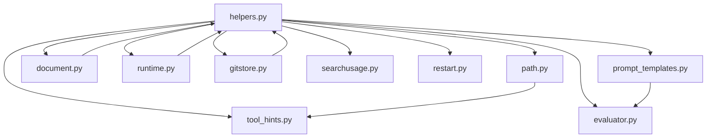

# summerclaw/utils — 通用工具模块

## 概述

`summerclaw/utils` 是 summerclaw Agent 框架的基础工具模块，提供一系列零业务耦合的通用功能，覆盖路径展示、文档解析、Git 版本控制、提示模板渲染、Token 估算、工具调用格式化、运行时保护、重启通知、搜索用量查询、以及后执行评估等场景。模块内的各组件被 Agent 执行管道、CLI、Channel、Memory、Heartbeat 等多个上层模块广泛复用。

## 核心设计原则

- **零副作用**：每个工具函数保持纯函数或只读操作，不隐式修改全局状态。
- **容错优先**：所有外部依赖（如 `pypdf`、`dulwich`、`httpx`）均采用 try/except 兜底，缺失时不阻断主流程。
- **可组合**：各子模块独立封装，仅通过明确导出的接口互调（如 `document.py` → `helpers.py` 的 `detect_image_mime`）。

## 模块结构

```
summerclaw/utils/
├── __init__.py           # 包入口，导出 ensure_dir / abbreviate_path
├── helpers.py            # 通用辅助函数（核心集合）
├── path.py               # 路径/URL 缩写展示
├── document.py           # 文档文本提取（PDF/DOCX/XLSX/PPTX/文本）
├── gitstore.py           # 基于 dulwich 的 Git 版本控制（记忆文件管理）
├── prompt_templates.py   # Jinja2 提示模板渲染引擎
├── runtime.py            # Agent 运行时保护（工具结果保障、外部调用限流）
├── restart.py            # 重启通知消息辅助
├── searchusage.py        # Web 搜索提供商用量查询
├── tool_hints.py         # 工具调用的简洁人类可读格式化
└── evaluator.py          # 后台任务结果评估器（Heartbeat/Cron 共用）
```

## 各组件详解

### 1. `helpers.py` — 通用辅助函数

核心工具函数集，是整个模块的基石。

| 函数 | 功能 | 关键行为 |
|------|------|----------|
| `strip_think(text)` | 剔除模型 `thinking` / `<thought>` 推理块 | 支持未闭合标签、多标签，防止正文中的引用误删 |
| `detect_image_mime(data)` | 通过魔术字节检测图片 MIME 类型 | 支持 PNG/JPEG/GIF/WEBP |
| `build_image_content_blocks(raw, mime, path, label)` | 构建多模态图片消息块 | 返回 `[{type: "image_url", ...}, {type: "text", ...}]` |
| `ensure_dir(path)` | 确保目录存在 | 幂等操作，调用 `mkdir(parents=True, exist_ok=True)` |
| `timestamp()` / `current_time_str(tz)` | 时间戳生成 | 支持 `zoneinfo` 时区 |
| `safe_filename(name)` | 替换路径不安全字符 | `[<>:"/\\|?*]` → `_` |
| `truncate_text(text, max_chars)` | 文本截断并附加 `(truncated)` 标记 | |
| `find_legal_message_start(messages)` | 定位消息列表中 tool_calls 与 tool results 配对的有效起点 | 用于上下文窗口截断保护 |
| `stringify_text_blocks(content)` | 将 `[{type:"text",...}, ...]` 格式转为纯文本 | 仅纯文本块才合并；含非文本块返回 `None` |
| `maybe_persist_tool_result(...)` | 超大工具输出持久化到磁盘 | 超过 `max_chars` 时写入 `.summerclaw/tool-results/`，返回引用文本 |
| `split_message(content, max_len)` | 按换行/空格智能分割长消息 | 默认 2000 字符（Discord 兼容） |
| `build_assistant_message(...)` | 构建 LLM 兼容的 assistant 消息 | 支持 `reasoning_content`、`thinking_blocks` 可选字段 |
| `estimate_prompt_tokens(messages, tools)` | 使用 tiktoken (`cl100k_base`) 估算提示 token | 计入 content/tool_calls/reasoning/name/tool_call_id + 每消息 4 token 开销 |
| `estimate_message_tokens(message)` | 单条消息的 token 估算 | 用于持久化消息的独立评估 |
| `estimate_prompt_tokens_chain(provider, model, messages, tools)` | 优先用 provider 内置计数器，回退 tiktoken | 返回 `(token_count, source)` |
| `build_status_content(...)` | 构建 `/status` 命令的人类可读运行时快照 | 包含版本/模型/token/context/uptime/任务数/搜索用量 |
| `sync_workspace_templates(workspace)` | 同步模板文件到工作区 | 仅创建缺失文件，并初始化 Git 版本控制 |

### 2. `path.py` — 路径缩写展示

用于在紧凑 UI（CLI 流式输出、heartbeat 通知）中展示路径/URL。

| 函数 | 功能 |
|------|------|
| `abbreviate_path(path, max_len=40)` | 缩写路径，遵循"保留文件名 → 逐步保留父目录 → 前缀 …/"策略 |
| `_abbreviate_url(url, max_len)` | URL 特殊处理：保留域名 + 文件名 |

**缩写策略**：
1. 短路径原样返回
2. 替换家目录为 `~/`
3. 从右向左保留 basename 和父目录，直至达到 `max_len` 预算
4. 前缀 `…/` 标记省略
5. Windows 路径（反斜杠）自动规范化为 `/`

### 3. `document.py` — 文档文本提取

为 Agent 提供将用户上传的文档文件转化为可读文本的能力。

| 函数 | 功能 |
|------|------|
| `extract_text(path)` | 根据扩展名分发到对应提取器；返回文本或错误占位符 |
| `extract_documents(text, media_paths)` | 高级接口：将 media_paths 中的图片和文档分流，文档文本追加到 `text` |

**支持格式**：

| 格式 | 依赖库 | 提取方式 |
|------|--------|----------|
| PDF | `pypdf` | `PdfReader` 逐页提取 |
| DOCX | `python-docx` | `Document.paragraphs` 逐段提取 |
| XLSX | `openpyxl` | `load_workbook(read_only=True)` 逐表逐行提取 |
| PPTX | `python-pptx` | 递归遍历 shape 树（含 Table/Group） |
| 纯文本（`.txt/.md/.csv/.json/.xml/.html/.log/.yaml/.toml/.ini/.cfg`） | 无 | UTF-8 → Latin-1 回退 |
| 图片（`.png/.jpg/.gif/.webp`） | 无 | 返回占位符 `[image: name]`（预留 OCR 支持） |

**保护机制**：
- 单个文件最大提取 200,000 字符
- 超过 50 MB 的文件跳过并告警
- 所有提取错误返回 `[error: ...]` 占位符，不抛异常

### 4. `gitstore.py` — Git 版本控制

基于 [dulwich](https://www.dulwich.io/) 纯 Python Git 实现，为记忆文件（`SOUL.md`、`USER.md`、`MEMORY.md`）提供版本管理。

**数据结构**：

| 类 | 用途 |
|----|------|
| `CommitInfo` | 提交摘要（短 SHA、消息、时间戳），含 `format(diff)` 渲染 |
| `LineAge` | 单行年龄，`age_days` 表示最后修改至今的天数 |
| `GitStore` | 主控制器 |

**`GitStore` 核心方法**：

| 方法 | 功能 |
|------|------|
| `init()` | 初始化仓库、写入 `.gitignore`、执行 initial commit |
| `is_initialized()` | 检查 `.git/` 目录是否存在 |
| `auto_commit(message)` | 暂存并提交追踪文件变更，无变更返回 `None` |
| `log(max_entries=20)` | 返回最近 N 条 `CommitInfo` |
| `line_ages(file_path)` | 通过 `porcelain.annotate` 获取每行的最后修改时间 |
| `diff_commits(sha1, sha2)` | 两提交间的 `unified diff` |
| `find_commit(short_sha)` | 短 SHA 前缀查找 |
| `show_commit_diff(short_sha)` | 查找提交并返回其与父提交的 diff |
| `revert(commit)` | 回退指定提交到父提交状态，生成新 revert commit |

**`.gitignore` 策略**：默认忽略所有文件（`/*`），仅白名单追踪文件和 `.gitignore` 自身。所有提交使用统一身份 `summerclaw <summerclaw@dream>`。

### 5. `prompt_templates.py` — 提示模板渲染

基于 Jinja2 的模板引擎，用于渲染 Agent 系统提示（位于 `summerclaw/templates/`）。

| 函数 | 功能 |
|------|------|
| `render_template(name, *, strip=False, **kwargs)` | 渲染指定模板文件，`strip=True` 去除尾部换行 |

**模板路径约定**：
- Agent 提示：`agent/identity.md`、`agent/platform_policy.md` 等
- 共享片段：`agent/_snippets/` 下，通过 `` 引用
- 模板引擎配置：`autoescape=False`（纯文本提示），`trim_blocks=True`，`lstrip_blocks=True`

### 6. `runtime.py` — Agent 运行时保护

Agent 循环运行时的防御性工具，防止无限循环和资源滥用。

| 常量/函数 | 功能 |
|-----------|------|
| `EMPTY_FINAL_RESPONSE_MESSAGE` | 工具步骤完成但无最终答案时的占位消息 |
| `FINALIZATION_RETRY_PROMPT` | 要求模型基于对话历史给出最终回复的提示 |
| `LENGTH_RECOVERY_PROMPT` | 输出 token 超限时的续写提示（禁止 recap/apology） |
| `empty_tool_result_message(tool_name)` | 生成"工具无输出"的可读标记 |
| `ensure_nonempty_tool_result(tool_name, content)` | 将 `None`/空字符串/空列表替换为标记 |
| `is_blank_text(content)` | 判断文本是否为空或仅空白 |
| `build_finalization_retry_message()` | 构建仅文本、禁止工具调用的 finalization 重试消息 |
| `build_length_recovery_message()` | 构建长度恢复提示消息 |
| `external_lookup_signature(tool_name, arguments)` | 为 `web_fetch`/`web_search`/`exec` 生成稳定签名用于去重 |
| `repeated_external_lookup_error(...)` | 阻止重复外部调用：第 3 次起返回错误，第 6 次起标记为 fatal（终止循环） |

### 7. `restart.py` — 重启通知

处理 summerclaw 进程重启后的跨进程通知（通过环境变量传递）。

| 函数 | 功能 |
|------|------|
| `set_restart_notice_to_env(channel, chat_id)` | 写入 `NANOBOT_RESTART_*` 环境变量通知下一进程 |
| `consume_restart_notice_from_env()` | 读取并清除环境变量中的重启通知（一次性消费） |
| `format_restart_completed_message(started_at_raw)` | 生成 "Restart completed in X.Xs." 消息 |
| `should_show_cli_restart_notice(notice, session_id)` | 判断当前 CLI 会话是否应显示重启通知 |

**数据流**：
```
进程 A (重启前)                    进程 B (重启后)
  set_restart_notice_to_env()  →  consume_restart_notice_from_env()
                                   → should_show_cli_restart_notice()
                                   → 推送 "Restart completed" 通知
```

### 8. `searchusage.py` — 搜索用量查询

为 `/status` 命令提供 Web 搜索提供商的 API 用量查询。

| 数据结构 | 用途 |
|----------|------|
| `SearchUsageInfo` | dataclass，承载 provider/used/limit/remaining/reset_date 等字段，含 `format()` 渲染方法 |

| 函数 | 功能 |
|------|------|
| `fetch_search_usage(provider, api_key)` | 根据 provider 名分发到对应的用量 API fetcher |
| `_fetch_tavily_usage(api_key)` | 调用 `GET https://api.tavily.com/usage`，解析 Tavily 响应 |

**支持的提供商**：
| 提供商 | API | 支持字段 |
|--------|-----|----------|
| Tavily | `/usage` | used/limit/remaining；search/extract/crawl 分类用量 |
| Brave/DuckDuckGo/SearXNG/Jina | 无 | `supported=False` |

### 9. `tool_hints.py` — 工具调用格式化

将结构化的工具调用列表渲染为简洁的人类可读字符串，用于 CLI 流式输出和 channel 通知。

| 函数 | 功能 |
|------|------|
| `format_tool_hints(tool_calls)` | 主入口：格式化工具调用列表，支持去重合并（`× N`） |

**注册的内置工具格式**：

| 工具名 | 格式模板 | 缩写策略 |
|--------|----------|----------|
| `read_file` | `read {path}` | 路径缩写 |
| `write_file` | `write {path}` | 路径缩写 |
| `edit` | `edit {path}` | 路径缩写 |
| `glob` | `glob "{pattern}"` | 直接展示 |
| `grep` | `grep "{pattern}"` | 直接展示 |
| `exec` | `$ {command}` | 命令中的路径缩写 |
| `web_search` | `search "{query}"` | 直接展示 |
| `web_fetch` | `fetch {url}` | 路径缩写 |
| `list_dir` | `ls {path}` | 路径缩写 |

**MCP 工具特殊处理**：解析 `mcp_server__tool` 命名，展示为 `server::tool("参数")` 格式。

**去重逻辑**：连续相同提示合并为 `hint × N`，如 `read loop.py × 3`。

### 10. `evaluator.py` — 后台任务结果评估

为 Heartbeat 和 Cron 等后台任务提供"是否通知用户"的 LLM 决策能力。

| 函数 | 功能 |
|------|------|
| `evaluate_response(response, task_context, provider, model)` | 调用 LLM tool-call 判断结果是否值得通知用户 |

**评估机制**：
1. 构造 System Prompt（`agent/evaluator.md` system 部分）+ User Prompt（含 `task_context` 和 `response`）
2. 调用 LLM 的 `evaluate_notification` tool，要求返回 `should_notify`（boolean）和 `reason`
3. 任何异常/无 tool call 返回时**默认通知**（safe-to-notify 策略，不丢失重要消息）
4. 使用 `temperature=0.0` 确保一致性

## 测试覆盖

| 测试文件 | 覆盖组件 | 测试场景 |
|----------|----------|----------|
| `tests/utils/test_strip_think.py` | `helpers.strip_think` | 闭合/未闭合 `<thought>` 标签、多标签、假阳性保护（正文中不误删） |
| `tests/utils/test_abbreviate_path.py` | `path.abbreviate_path` | 短路径、家目录替换、长路径缩略、Windows 路径、URL 缩写、边界预算 |
| `tests/utils/test_gitstore.py` | `gitstore.GitStore` | 未初始化 / 缺失文件 / 空文件返回空、逐行年龄、跨天年龄差异、annotate 失败兜底 |
| `tests/utils/test_restart.py` | `restart` | 环境变量 set/consume 往返、过期消息格式化、CLI 会话过滤 |
| `tests/utils/test_searchusage.py` | `searchusage` | Tavily 用量 API 响应解析、非 Tavily 提供商不支持标记、HTTP 错误兜底 |

## 关联模块

`summerclaw/utils` 被以下模块广泛引用：

| 上层模块 | 引用的 utils 组件 |
|----------|-------------------|
| `summerclaw/agent/loop.py` | `runtime` (repeated_external_lookup_error, ensure_nonempty_tool_result), `tool_hints`, `helpers` (token 估算), `evaluator` |
| `summerclaw/agent/context.py` | `helpers` (maybe_persist_tool_result, estimate_prompt_tokens_chain) |
| `summerclaw/agent/runner.py` | `runtime` (build_finalization_retry_message, build_length_recovery_message) |
| `summerclaw/agent/planner.py` | `prompt_templates` (render_template) |
| `summerclaw/session/manager.py` | `restart` (consume_restart_notice_from_env) |
| `summerclaw/cli/stream.py` | `tool_hints` (format_tool_hints), `path` (abbreviate_path) |
| `summerclaw/cli/__init__.py` | `restart` (should_show_cli_restart_notice) |
| `summerclaw/channels/` (各 channel) | `helpers` (split_message, truncate_text), `restart` |
| `summerclaw/heartbeat/service.py` | `evaluator` (evaluate_response) |
| `summerclaw/cron/service.py` | `evaluator` (evaluate_response) |
| `summerclaw/summerclaw.py` | `helpers` (build_status_content), `searchusage` (fetch_search_usage) |
| `summerclaw/memory/` (各算法) | `gitstore` (GitStore), `helpers` (ensure_dir, sync_workspace_templates) |

## 依赖关系

模块内部依赖（无循环）：



外部依赖（均为可选，缺失时不阻断主流程）：

| 依赖包 | 用途 | 所属组件 |
|--------|------|----------|
| `tiktoken` | Token 估算 | `helpers.py` |
| `dulwich` | Git 版本控制 | `gitstore.py` |
| `jinja2` | 模板渲染 | `prompt_templates.py` |
| `pypdf` | PDF 文本提取 | `document.py` |
| `python-docx` | DOCX 文本提取 | `document.py` |
| `openpyxl` | XLSX 文本提取 | `document.py` |
| `python-pptx` | PPTX 文本提取 | `document.py` |
| `httpx` | Tavily 用量 API 查询 | `searchusage.py` |